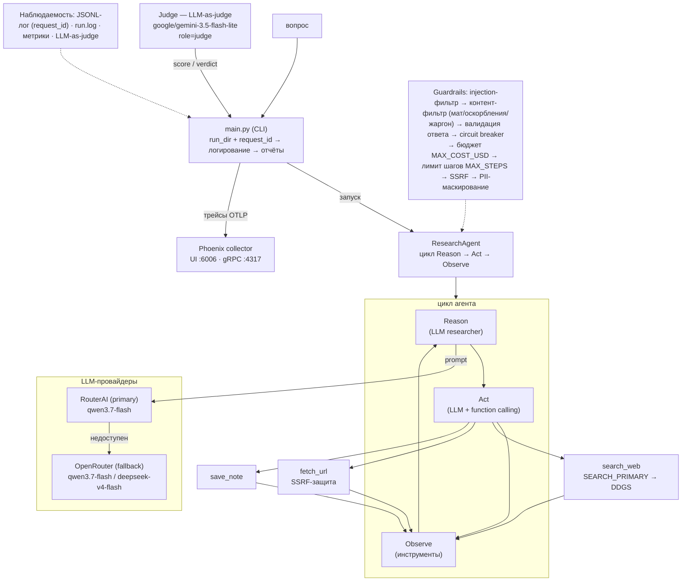

# ResearchGuardAgent — исследовательский агент с observability и guardrails

Домашнее задание модуля «Контроль качества агента» (уроки **Evals/Observability** и **Guardrails**).

Один LLM-агент с циклом **Reason → Act → Observe**:
- планирует исследование,
- вызывает инструменты (`search_web`, `fetch_url`, `save_note`),
- анализирует результаты,
- повторяет до готовности,
- формирует финальный ответ со структурой `{answer, sources[], confidence, summary}`.

**Модели по ролям** (задаются в `.env` / `.env.example`):
- **исследователь** (`RESEARCHER_MODEL`, по умолчанию `qwen/qwen3.7-flash`) через **RouterAI** (primary) + **OpenRouter** (fallback);
- **судья** (LLM-as-judge, `JUDGE_MODEL`, по умолчанию `google/gemini-3.5-flash-lite`) — отдельная модель для оценки ответов.

### Обоснование выбора модели судьи

Модель судьи подобрана намеренно и отличается от модели исследователя:

| Критерий | Выбор | Обоснование |
|---|---|---|
| **Вендор** | Google Gemini (не китайская LLM) | Исследователь работает на китайских моделях (qwen/deepseek). Судья на модели другого вендора (Google) исключает «родственную» оценку своей экосистемы — независимость оценки |
| **Юрисдикция** | Google (США/ЕС) | Провайдер вне юрисдикции, регулирующей qwen/deepseek; меньше риск систематического смещения оценки в пользу моделей одного стека |
| **Отдельная роль** | `role="judge"` → `JUDGE_MODEL` | Модель судьи не совпадает с моделью исследователя → модель не оценивает собственные ответы (self-evaluation bias исключён на уровне конфигурации) |
| **Класс** | flash-lite | Достаточно мощная для критериальной оценки (factual_accuracy, completeness, structure), дешёвая, быстрая — оценка каждого ответа стоит доли цента |

Итог: исследователь и судья — разные модели разных вендоров; судья извне китайского LLM-стека. Выбор зафиксирован в `.env`/`.env.example` (`JUDGE_MODEL`, `ROUTERAI_JUDGE_MODEL`, `OPENROUTER_JUDGE_MODEL`) и не захардкожен. Для отказоустойчивости у судьи свой фолбек `JUDGE_FALLBACK_MODELS` (по умолчанию `google/gemini-3.1-flash-lite`) — он перебирает модели на том же провайдере, и это **отдельный список от `FALLBACK_MODELS`**, чтобы судья не деградировал на модели исследователя (сохраняется независимость оценки).

Цены RouterAI в рублях: qwen3.7-flash 3,10₽/13₽ за 1M; deepseek-v4-flash 9₽/18₽ за 1M
(конвертируются в USD для метрик бюджета через `RUB_TO_USD_RATE`).

## Схема архитектуры



## Возможности

| Блок | Что делает |
|---|---|
| LLM | OpenAI-совместимый SDK, **RouterAI** (primary, `LLM_PRIMARY_PROVIDER=routerai`) + **OpenRouter** (fallback, опционально — в РФ работает только под VPN) с аналогичными моделями (deepseek-v4-flash, qwen3.7-flash), у RouterAI — отдельный увеличенный таймаут `ROUTERAI_TIMEOUT`; отдельная модель судьи `JUDGE_MODEL` (google/gemini-3.5-flash-lite) со своим фолбеком `JUDGE_FALLBACK_MODELS` (google/gemini-3.1-flash-lite); retry с backoff (3 попытки: 1→2→4с), обработка 429/5xx/таймаутов |
| Поиск | По приоритету `SEARCH_PRIMARY` (`yandex`/`tavily`, работают только настроенные движки — есть ключ); **DDGS** — всегда универсальный fallback. Таймауты `SEARCH_TIMEOUT`/`FETCH_TIMEOUT` |
| Инструменты | `search_web`, `fetch_url` (таймаут 15с, лимит 8000 символов), `save_note` |
| Метрики | `success`, `elapsed_sec`, `total_cost_usd`, `num_steps`, per-step метрики (инструмент, длительность, статус) |
| Логирование | Rich-консоль + JSONL-лог шагов в `logs/run_<timestamp>.jsonl` + `output/run_<timestamp>/run.log` |
| Phoenix (этап 2) | легкий режим: агент не поднимает собственный сервер, трейсы отправляются через `phoenix.otel.register()` + OpenInference-инструментирование OpenAI в отдельный коллектор `phoenix serve` (UI на http://localhost:6006) |
| Guardrails (этап 2) | лимит бюджета `MAX_COST_USD`, валидация финального ответа, фильтр prompt-injection, контент-фильтр входа (ненормативная лексика/оскорбления/жаргон), circuit breaker (3 ошибки подряд → fail closed, с half-open cooldown 30с), SSRF-защита `fetch_url` (denylist приватных сетей), разметка веб-контента как данных (не инструкций), маскирование PII/секретов в логах |
| Evals (этап 2) | LLM-as-judge (score 0..10 + вердикт, отдельная модель `JUDGE_MODEL`), `eval_golden.py` по golden set, отчёты в `evals/` |

## Установка

```bash
# 1) venv
python -m venv .venv
# Windows:
.venv\Scripts\activate
# Linux/macOS:
source .venv/bin/activate

# 2) зависимости
pip install -r requirements.txt

# 3) конфигурация
copy .env.example .env   # и заполните ключи
```

## Запуск

```bash
python main.py "Кто такой Альберт Эйнштейн?"
python main.py "Что такое Langfuse?" --max-steps 4 --max-cost 0.3
python main.py "вопрос" --no-phoenix
```

Аргументы:

| Аргумент | Назначение | Default |
|---|---|---|
| `question` (позиционный) | Вопрос для исследования | — |
| `--max-steps N` | Максимум итераций цикла | `MAX_STEPS` (6) |
| `--max-cost USD` | Максимальный бюджет прогона | `MAX_COST_USD` (0.5) |
| `--no-phoenix` | Отключить запуск Phoenix | `PHOENIX_ENABLED` |

## Результаты прогона

После запуска в `output/run_<timestamp>/` создаются:
- `answer.md` — финальный ответ агента (answer, sources, confidence, summary);
- `run.log` — файловый лог;
- `dz_report.md` — сводка по ДЗ (этап 2).

JSONL-лог шагов: `logs/run_<timestamp>.jsonl`.

Полный пример запроса и результата (реальный прогон: метрики, лог шагов, guardrails, вердикт судьи): [examples/example_run.md](examples/example_run.md).

Каждый прогон получает **`request_id`** (формат `req_<timestamp>_<hex>`) — он проставляется в каждую запись JSONL-лога и в шапки `answer.md`/`dz_report.md`, что позволяет связывать логи, отчёт и папку прогона между собой.

## SOP агента (промпт)

Правила работы агента — планирование → поиск → проверка фактов → финальный JSON —
**зашиты в system-промпт** `SYSTEM_PROMPT` (`src/agent.py:28`) и передаются модели
при каждом запуске как `{"role": "system", "content": SYSTEM_PROMPT}`
(`src/agent.py:321`). Дополнительно модель получает описания инструментов
(`TOOLS_SCHEMA` в `src/tools.py`): в них задано, *когда и как* вызывать каждый
инструмент. Модель сама решает, какой инструмент использовать и когда завершить
цикл. Ниже — runbook для человека: как запускать проект и проверять качество.

### Проверка и контроль качества (runbook)

1. **Подготовка**: создать `.env` из `.env.example` (ключи провайдеров, `RESEARCHER_MODEL`, `JUDGE_MODEL`, бюджеты `MAX_STEPS`/`MAX_COST_USD`).
2. **Единичный прогон**: `python main.py "вопрос"` → проверить в `output/run_<timestamp>/answer.md`, что `success: True`, `stop_reason: completed`, `confidence` и список `sources` не пустые.
3. **Связанные артефакты**: по `request_id` из шапки `answer.md` найти записи этого же запроса в `logs/run_<timestamp>.jsonl`.
4. **Контроль качества**: в `output/run_<timestamp>/dz_report.md` проверить: guardrails (injection: `False`, валидация: `valid: True`, circuit breaker: `open: False`), стоимость против бюджета, вердикт судьи (score/verdict/comment).
5. **Повторяемость**: для оценки стабильности запустить `python eval_golden.py --runs 3` и сравнить pass@1 (mean/std) и средний judge-score в `evals/report_<timestamp>.md`.
6. **Разбор сбоев**: если `success: False` — смотреть `stop_reason` (`max_steps_exceeded`, `budget_exceeded`, `error: ...`); при `error` с «Connection error»/403 — проверить ключи провайдера и доступность сети, затем повторить шаг 2.

## Phoenix (observability)

Легкий режим: агент сам сервер не поднимает, а шлёт трейсы (OTLP HTTP
`http://localhost:6006/v1/traces`, gRPC `:4317`) в отдельный коллектор.

```bash
# 1) стартуем коллектор (фоновый процесс, UI на http://localhost:6006)
#    Windows (cmd):   serve_phoenix.bat
#    Windows (PS):    .\serve_phoenix.ps1
#    macOS/Linux:     ./serve_phoenix.sh
#    либо вручную (3 переменные + phoenix serve):
#      Windows:       set PHOENIX_ENABLE_MCP_SERVER=false ^
#                     set PHOENIX_ALLOWED_SANDBOX_PROVIDERS=NONE ^
#                     set PHOENIX_ALLOW_EXTERNAL_RESOURCES=false
#      macOS/Linux:   export PHOENIX_ENABLE_MCP_SERVER=false \
#                     PHOENIX_ALLOWED_SANDBOX_PROVIDERS=NONE \
#                     PHOENIX_ALLOW_EXTERNAL_RESOURCES=false
phoenix serve

# 2) в другом терминале запускаем агента
python main.py "Что такое OpenTelemetry?"   # без --no-phoenix
# откройте http://localhost:6006 — трейсы LLM-вызовов и инструментов
```

Помимо авто-трассировки LLM-вызовов (OpenInference OpenAI Instrumentor) агент
создаёт **кастомные спаны** всего конвейера (`src/tracing.py`), так что в UI
виден не только вызов модели, но и логика поверх него:

- `agent.run` — корневой спан прогона (вопрос, request_id, итог: success/confidence);
- `guardrail.prompt_injection` — проверка вопроса на prompt-injection;
- `guardrail.content_filter` — контент-фильтр (мат/оскорбления/жаргон);
- `guardrail.validate_answer` — валидация финального ответа;
- `tool.*` — вызовы инструментов (`search_web`, `fetch_url`, `save_note`) с аргументами и результатом.

Если Phoenix не зарегистрирован — OTel использует no-op TracerProvider, спаны
никуда не экспортируются, агенту это не мешает (graceful degrade).

Скрипты `serve_phoenix.bat` / `serve_phoenix.ps1` / `serve_phoenix.sh` выставляют
перечисленные env-переменные автоматически. Они отключают на хосте неиспользуемые
фичи Phoenix 19.x, которые иначе замедляют/роняют/шумят старт: docs MCP-сервер
(лезет в сеть, ошибки SSL/DNS), code sandbox (на Windows Monty worker падает с
`0xc0000135` — отсутствующая DLL; WASM-бинарник не скачивается из-за ошибки
верификации SSL-сертификата в Python) и внешние ресурсы. БД коллектора
постоянная — `~/.phoenix/phoenix.db`, повторные старты быстрые (миграции
выполняются один раз, ~12 c при первом запуске).

Если Phoenix не установлен или упал — агент продолжит работу без трассировки (graceful degrade).

> **Известные проблемы на Windows:** Phoenix SDK 19.x требует `greenlet` (для SQLAlchemy async).
> На Python 3.12 версия `greenlet 3.5.4` падает с `DLL load failed`, поэтому в
> `requirements.txt` зафиксирована рабочая `greenlet==3.1.1`. Встроенный сервер через
> `launch_app()` на этой машине не поднимается (`RuntimeError: server took too long to start`):
> свежая временная БД мигрируется ~12 c при жёстком лимите 5 c плюс попытки скачать
> WASM-бинарник песочницы с github.com (падает с ошибкой верификации SSL-сертификата
> в Python). Поэтому и используется внешний `phoenix serve` с постоянной БД. При
> недоступности UI агент работает без трассировки (graceful degrade) — метрики и
> JSONL-логи шагов сохраняются всегда.

## Evals (этап 2)

```bash
python eval_golden.py                          # прогон по golden set (10 вопросов)
python eval_golden.py --runs 3                 # стабильность по 3 прогонам
python eval_golden.py --limit 2 --no-phoenix   # быстрый прогон без Phoenix
```

**Golden set** хранится в отдельном файле `evals/golden_set.json` и загружается
`eval_golden.py` из него (не зашит в код) — формат: список объектов
`{"question": "...", "expected": ["ключ1", "ключ2"], "hint": "..."}`, где
`expected` — ключевые сущности, по которым считается pass@1 (ответ должен
содержать их все). Вопросы можно свободно добавлять/редактировать в этом файле;
`--limit N` берёт первые N вопросов.

Результаты: `evals/results_eval_<timestamp>.json` и `evals/report_<timestamp>.md`.

При `--runs N > 1` в отчёт добавляется раздел **Стабильность**: разброс pass@1
и success по прогонам (mean/std), стоимость и время по прогонам, доля успешных
прогонов по каждому вопросу.

Eval-прогон трассируется в Phoenix (если `PHOENIX_ENABLED=true` и не указан
`--no-phoenix`). Помимо этого `eval_golden.py` загружает **golden set как
датасет** во вкладку *Datasets* Phoenix (API `phoenix.client.Client` →
`create_dataset`, таблица: question → input, expected → output, hint → metadata).
Датасет виден в UI без прогона, из него же можно запускать эксперименты.

## Тестирование (unit)

```bash
pip install pytest
python -m pytest tests/ -v
```

Покрыты: prompt-injection фильтр, контент-фильтр (мат/оскорбления/жаргон),
валидация ответа, circuit breaker
(open/half-open/closed), SSRF-защита (denylist, числовые формы IPv4, редиректы),
парсинг судьи (LLM-as-judge), метрики, сбор фактов в partial-ответе.

## Структура

```
research_guard_agent/
├── .env.example             # шаблон окружения (сам .env не пушится)
├── .gitignore
├── requirements.txt
├── README.md
├── main.py                  # CLI: прогон агента + инициализация Phoenix
├── eval_golden.py           # прогон по golden set (+ --runs, загрузка датасета в Phoenix)
├── serve_phoenix.bat/.ps1/.sh # запуск коллектора Phoenix (Windows/macOS/Linux)
├── examples/                # пример запроса и результата (example_run.md)
├── src/
│   ├── __init__.py
│   ├── config.py            # pydantic Settings (env, лимиты, провайдеры, поиск)
│   ├── llm_client.py        # RouterAI (primary) + OpenRouter (fallback), retry, cost
│   ├── tools.py             # search_web / fetch_url (SSRF-safe) / save_note
│   ├── agent.py             # цикл Reason → Act → Observe
│   ├── guardrails.py        # injection-детектор, контент-фильтр, валидация ответа, circuit breaker
│   ├── judge.py             # LLM-as-judge (score/verdict/comment)
│   ├── metrics.py           # MetricsCollector
│   ├── tracing.py           # кастомные OpenInference-спаны (agent.run, guardrail.*, tool.*)
│   └── logging_setup.py     # rich + JSONL + run.log
├── tests/                   # unit-тесты (agent/guardrails/SSRF/метрики/judge)
└── evals/
    └── golden_set.json      # golden set: вопросы + ожидаемые сущности
```

Что **не** попадает в репозиторий (`.gitignore`): `.env` (секреты), `.venv/`,
`logs/`, `output/`, `evals/results_*.json`, `evals/report_*.md`, `__pycache__/`,
`.pytest_cache/`, `tmp/` и `research_guard_agent/` — локальное хранилище
коллектора Phoenix (`.phoenix_local`, трейсы). Для демонстрации пушить нужно
только перечисленное выше дерево + `README.md`.

## Безопасность (guardrails)

Реализованные защитные механизмы:

| № | Защита | Тип | Место |
|---|--------|-----|-------|
| 1 | **Prompt-injection детектор** | Regex-эвристики на входе | [`guardrails.py`](src/guardrails.py:42) |
| 2 | **Контент-фильтр входа** | Ненормативная лексика, оскорбления, жаргонизмы (мат RU/EN, оскорбления, сленг) → блок запроса | [`guardrails.py`](src/guardrails.py:67) |
| 3 | **Валидация финального ответа** | Проверка JSON-схемы (answer, sources, confidence, summary) | [`guardrails.py`](src/guardrails.py:63) |
| 4 | **Circuit breaker** | 3 ошибки подряд → fail closed, half-open через 30с cooldown | [`guardrails.py`](src/guardrails.py:111) |
| 5 | **Лимит бюджета** | `MAX_COST_USD` — остановка при превышении | [`agent.py`](src/agent.py:326) |
| 6 | **Лимит шагов** | `MAX_STEPS` — остановка зацикливания | [`agent.py`](src/agent.py:301) |
| 7 | **SSRF-защита** | Denylist + DNS-резолв IP (`ipaddress`) + парсер числовых форм IPv4 (127.1, 2130706433, 0x7f000001, octal) + проверка каждого редиректа | [`tools.py`](src/tools.py:361) |
| 8 | **Разметка контента** | Веб-данные помечаются как `[ДАННЫЕ ДЛЯ АНАЛИЗА]`, а не как инструкции | [`agent.py`](src/agent.py:142) |
| 9 | **Маскирование PII** | API-ключи, email, токены маскируются в JSONL-логах | [`logging_setup.py`](src/logging_setup.py:53) |
| 10 | **Retry с backoff** | 3 попытки (1→2→4с) для transient-ошибок LLM | [`llm_client.py`](src/llm_client.py:196) |

### Уровень зрелости безопасности

По шкале занятия: от уровня 0 («надеемся на модель») до уровня 2-3 («policy engine + defense in depth»).

## Переменные окружения

Все ключи читаются из `.env` (см. `.env.example`). `.env` добавлен в `.gitignore` — случайный коммит ключей предотвращён.
Ключи в коде не хардкодятся.

| Переменная | Назначение |
|---|---|
| `ROUTERAI_API_KEY` / `ROUTERAI_BASE_URL` | Primary LLM-провайдер (по умолчанию `LLM_PRIMARY_PROVIDER=routerai`) |
| `OPENROUTER_API_KEY` / `OPENROUTER_BASE_URL` | Fallback LLM-провайдер |
| `LLM_MODEL` / `RESEARCHER_MODEL` | Модель исследователя (роль «исследователь») |
| `JUDGE_MODEL` | Модель судьи LLM-as-judge (роль «судья»), по умолчанию google/gemini-3.5-flash-lite |
| `LLM_PRIMARY_PROVIDER` | Провайдер по умолчанию: `routerai`/`openrouter` (остальные — fallback) |
| `ROUTERAI_JUDGE_MODEL` / `OPENROUTER_JUDGE_MODEL` | Модель судьи для конкретного провайдера |
| `ROUTERAI_MODEL` / `OPENROUTER_MODEL` | Модель исследователя для конкретного провайдера (иначе `LLM_MODEL`) |
| `FALLBACK_MODELS` | Дополнительные fallback-модели через запятую (после основной) |
| `JUDGE_FALLBACK_MODELS` | Fallback-модели судьи через запятую (после `JUDGE_MODEL`, отдельный список от `FALLBACK_MODELS` — судья остаётся моделью другого вендора) |
| `YANDEX_API_KEY` / `YANDEX_FOLDER_ID` | Yandex Search API |
| `TAVILY_API_KEY` | Tavily (опциональный fallback поиска) |
| `SEARCH_PRIMARY` | Поисковик по умолчанию (`yandex`/`tavily`); DDGS — всегда универсальный fallback |
| `MAX_STEPS` | Лимит шагов (6) |
| `MAX_COST_USD` | Лимит бюджета (0.5) |
| `REQUEST_TIMEOUT` | Таймаут LLM-запросов, сек (30) |
| `ROUTERAI_TIMEOUT` | Таймаут для RouterAI (primary), сек (120) |
| `SEARCH_TIMEOUT` | Таймаут веб-поиска Yandex/DDGS/Tavily, сек (30); DDGS дополнительно обрезается общим лимитом по времени |
| `FETCH_TIMEOUT` | Таймаут загрузки страницы fetch_url, сек (15) |
| `PHOENIX_ENABLED` | Запускать Phoenix (true) |
| `PHOENIX_PROJECT_NAME` | Имя проекта в Phoenix (research-guard-agent) |
| `COST_PER_1M_PROMPT` / `COST_PER_1M_COMPLETION` | Цены для расчёта стоимости, если провайдер не вернул `total_cost` |

## Расчёт стоимости

Как считается стоимость LLM-вызовов (и исследователя, и судьи):

1. **Приоритет — цена от провайдера.** Если провайдер вернул стоимость, берётся она:
   - **RouterAI** — поле `response.cost` (в рублях), конвертируется в USD через `RUB_TO_USD_RATE`;
   - **OpenRouter** — поле `usage.total_cost` (в USD).
   Обе величины **модель-специфичны**, поэтому смена модели (в т.ч. модели судьи `JUDGE_MODEL`) не требует правок кода — цену подставляет сам провайдер.

2. **Fallback — `_estimate_cost` по токенам** (`src/llm_client.py:56`). Используется только если провайдер не вернул стоимость. Цены заданы в `.env`:
   - RouterAI: `ROUTERAI_COST_PER_1M_PROMPT_RUB` / `ROUTERAI_COST_PER_1M_COMPLETION_RUB` (deepseek-flash: 9/18₽) и `QWEN_COST_PER_1M_PROMPT_RUB` / `QWEN_COST_PER_1M_COMPLETION_RUB` (qwen3.7-flash: 3,10/13₽);
   - остальные провайдеры (в т.ч. OpenRouter): `COST_PER_1M_PROMPT` / `COST_PER_1M_COMPLETION` в USD.
   Это грубая оценка: для моделей вне списка (например gemini-3.5-flash-lite) берутся цены deepseek-flash.

3. **Бюджет и судья.** `total_cost_usd` в метриках агента учитывает только вызовы **исследователя** (против него работает лимит `MAX_COST_USD`). Стоимость судьи (`Judge.evaluate`) возвращается отдельно в `judge_res["cost_usd"]` и в бюджет агента **не входит**.
